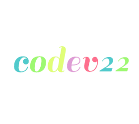

Welcome to my profile github 😊 chekout my repository to know the projects that I have made☺️

# Skills
```py
Skill = {
    "Programming" : ["Python", "C++"],
    "Website": ["HTML", "CSS"],
    "IDE": ["VSCODE", "PYCHARM]
    "Skils_Presentage" : {
        "Python" : 100,
        "C++" : 56,
        "HTML" : 100,
        "CSS" : 100,
    }
}
```
I usually use the VsCode IDE, because it supports many programming languages ​​including cpp and java 😁

# My Badge



<!---
Codev22/Codev22 is a ✨ special ✨ repository because its `README.md` (this file) appears on your GitHub profile.
You can click the Preview link to take a look at your changes.
--->
